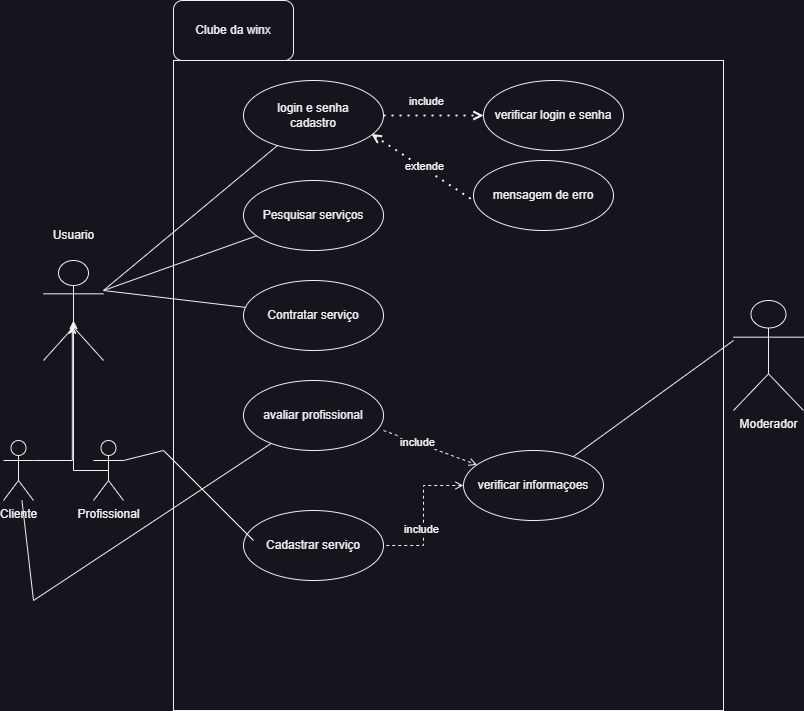
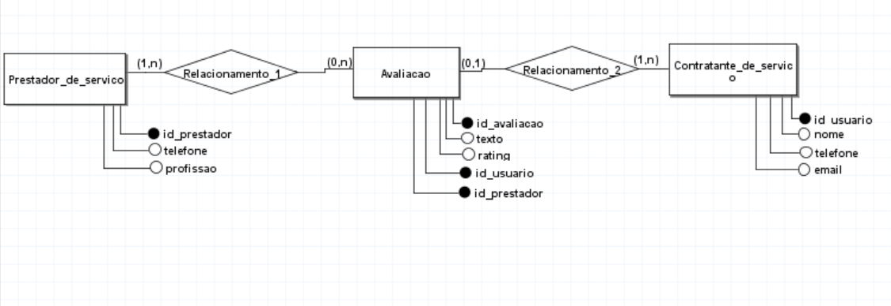

 # DOCUMENTAÇÃO DO PROJETO

 # CONTRATA FÁCIL

 ## INTRODUÇÃO

 Contrata Fácil se trata de uma aplicação mobile desenvolvida com Flutter, que traz consigo a possibilidade de contratar pequenos serviços, como por exermplo contratar uma diarista sem sequer precisar sair de casa ou na rotina corrida, no pouco tempo que se tem
não precisar ir atrás de alguém de confiança, pois o aplicativo faz a ponte entre um prestador de serviço confiável e um cliente necessitado. Basta fazer o login e escolher o seu serviço! 

## ARQUITETURA

Para a criação do Contrata Fácil foi ultilizado a arquitetura 
MVC:

**Model**: Pasta na qual fica os arquivos de armazenamento de 
dados do (Usuário, Prestadores e tabela de avaliações).

**View**: Pasta na qual fica a interface da aplicação. Telas 
de cadastro de usuário, tela de login, tela de cadastro de 
prestador, tela de serviços, tela de perfil, tela Home.

**Control**: Pasta responsável por realizar o processo de
intermediação entre **Model** e **View**, sendo responsável 
pelo gerenciamento dos dados entre telas e banco de dados. 

 

 ## FUNCIONALIDADES 

 Contrata Fácil conta com  as seguintes principais:

<!-- Código para por imagens dentro da documentação  -->

1. **Registro de Usuário**
- Os usuários criam uma conta inoformando nome,
email e criando uma senha. 
- Caso ele queira se cadastrar 
como Prestador de serviços, mais para frente ele tem essa opção
e terá que informar seu telefone e sua especialidade.

2. **Login e autenticação**
- Após realizar o seu cadastro, ele ficará salvo no banco de dados
e quando o usuário for fazer login novamente, então só precisará ser feito
a autenticação do email e senha escritos com o email e senha do banco de dados.

! [Saiba Mais](flutter_application_1/docs/arquitetura.md)

## BANCO DE DADOS

' Tabela Usuário '
   - **idUser** : identificador único para o usuário
   - **nome** : nome do usuário 
   - **email** : email do usuário
   - **senha** : senha do usuário

   ' Tabela Prestador '
   - **idprestador** : identificador único para o Prestador
   - **nome** : nome do Prestador
   - **telefone**:  telefone do prestador
   - **especialidade** : especialidade do prestador de serviço
   
   ' Tabela Avaliacao ' 
   - **idAvaliacao** : indentificador único de Avaliacao
   - **texto** : variavel que recebe a parte escrita da avialiação
   - **rating** : variavel que recebe o número de avalição
   - **idUser** : identificador único de usuario referenciado
   - **idPrestador** : indentificador único de prestador referenciado 

